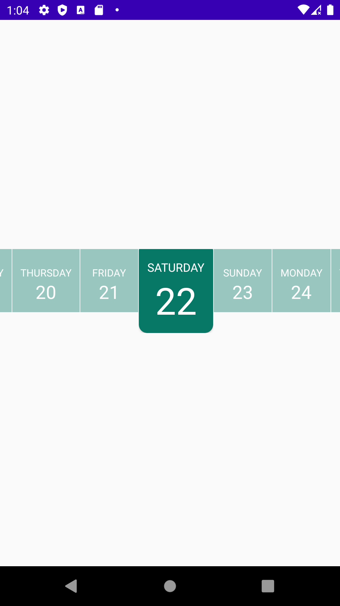
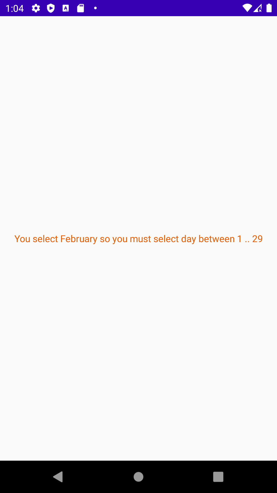

# HorizCalendar

<p align="center">
  
  
</p>


# Project build.gradle 
```
allprojects {
    repositories {
        ...
        jcenter()
        ...
    }
}
```

# app build.gradle 
```
dependencies {
    ...
    implementation 'dev.hussein.horiz-calendar:horiz-calendar:0.0.1'
}
```
# HOW TO USE 
```
<dev.hussein.h_calendar.HorizontalCalendar
        android:layout_width="match_parent"
        android:layout_height="wrap_content"
        app:hc_day="22"
        app:hc_month="february"
        app:hc_text_color="#ffffff"
        app:hc_year="2020"
        app:hc_background_color="#087866"
        app:hc_error_text_color="#E85D00" />
```

```
mbiniding.calendarView.apply {
            val cal = Calendar.getInstance()

            onDateSelected = object : HorizontalCalendar.OnDateSelected {
                override fun onDate(date: Date) {
                }

            }
            setDay(cal[Calendar.DAY_OF_MONTH], false)
            setMonth(HorizontalCalendar.Month.valueOf(cal[Calendar.MONTH]), false)
            setYear(cal[Calendar.YEAR], true)
        }
```
